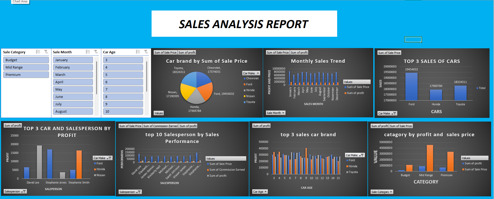

# 🚗 Car Sales Analysis Dashboard

This project presents an interactive **Car Sales Analysis Dashboard** built using **Microsoft Excel**.  
The dashboard analyzes sales performance, profit trends, brand performance, and salesperson productivity.

---

## 📊 Project Overview

The dashboard provides insights into car sales data for the year **2025**.  
It helps businesses understand sales trends, top-performing brands, and profit distribution across different categories.

---

## 📂 Dataset

Source: Kaggle  
Dataset Type: Retail Sales Data

The dataset contains information such as:

- Car Brand
- Sales Price
- Profit
- Salesperson
- Car Age
- Sales Month
- Sales Category

---

## 📈 Dashboard Features

The dashboard includes multiple analytical visualizations:

- Car Brand by Total Sales
- Monthly Sales Trend
- Top 3 Car Brands by Sales
- Top 10 Salespersons by Performance
- Category-wise Sales and Profit
- Car Age vs Profit Analysis
- Top 3 Salesperson by Profit

Interactive filters included:

- Sale Category
- Sale Month
- Car Age

---

## 📊 Key Metrics

- **Total Sales Value:** ₹90,312,553
- **Total Profit:** ₹18,062,510
- **Top Car Brand:** Ford
- **Best Sales Month:** January
- **Top Salesperson:** David Lee

---

## 💡 Insights

- Premium category generates the highest profit.
- Ford and Honda are the top-performing brands.
- Some months show lower sales and require marketing improvements.
- High-performing salespersons contribute significantly to revenue.

---

## 📌 Recommendations

Based on the analysis, the following recommendations can help improve business performance:

- Focus marketing strategies on the **Premium category** since it generates the highest profit.
- Maintain sufficient inventory of **top-performing brands like Ford and Honda** to meet customer demand.
- Introduce **incentive programs for top-performing salespersons** to motivate the sales team.
- Implement promotional campaigns during **low-performing months** to boost sales.
- Analyze customer preferences to improve sales in **budget and mid-range segments**.

---

## 🛠 Tools Used

- Microsoft Excel
- Pivot Tables
- Pivot Charts
- Data Cleaning
- Interactive Dashboard Design

---

## 📷 Dashboard Preview

